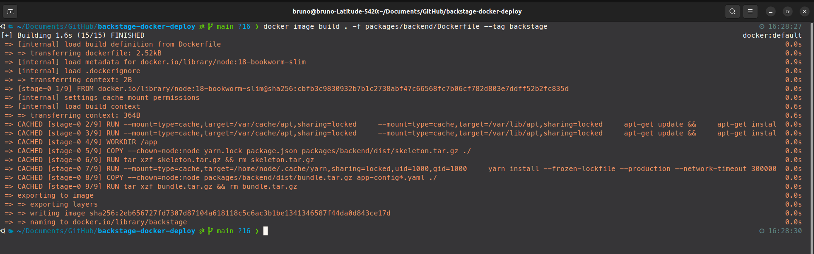
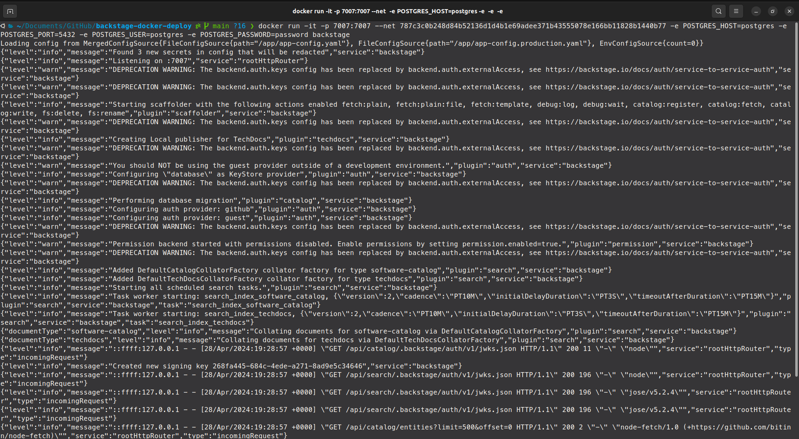
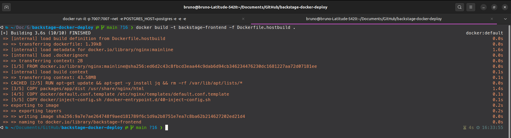
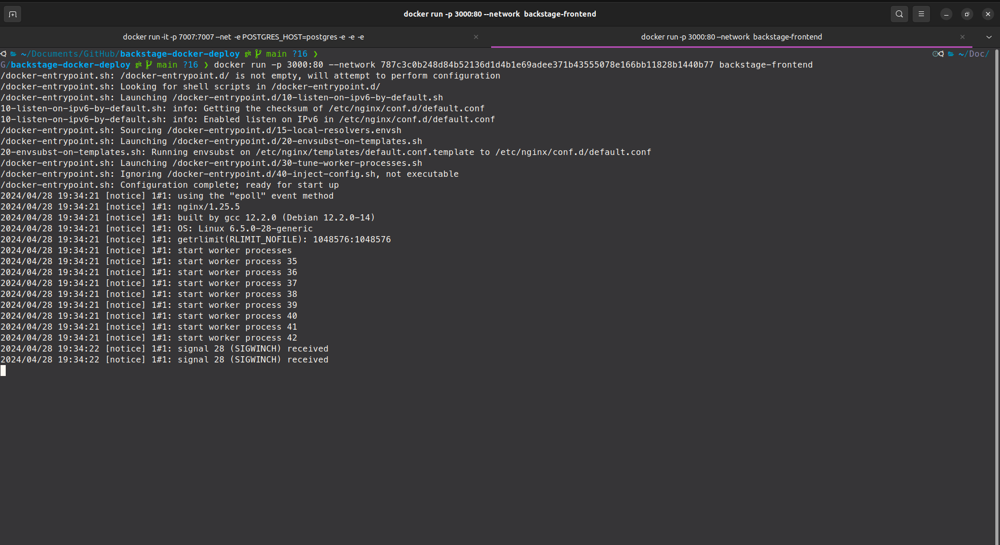
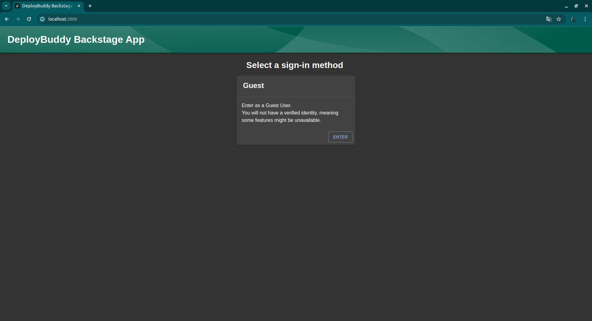
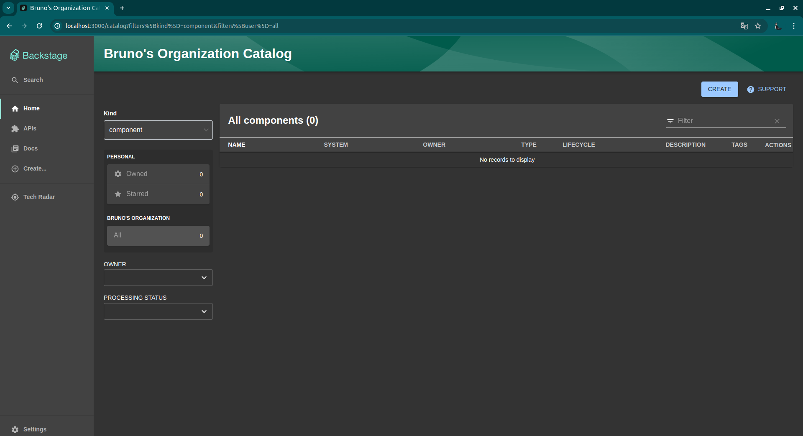

# Relatório Deploy Backstage em Docker

## Introdução

O Backstage é uma plataforma desenvolvida pelo Spotify para facilitar o desenvolvimento, organização e descoberta de serviços e ferramentas dentro de uma organização. Ele fornece uma estrutura unificada para gerenciar pipelines de CI/CD, visualizar métricas de serviço, documentação e muito mais. Este relatório visa fornecer um resumo detalhado do processo de implantação do Backstage em docker em serviços separados um do outro, conforme descrito no documentação do [Backstage](https://backstage.io/docs/deployment/docker).

A capacidade de integração do Backstage com várias tecnologias de infraestrutura, como Docker, o torna altamente flexível e escalável. Ao final deste documento ficará claro os conceitos fundamentais de implantação do Backstage em docker, incluindo configurações locais.

## Tecnologia e Conceitos

### Tecnologia Utilizada

O artigo detalha o uso de diversas tecnologias para a implantação do Backstage, incluindo:

- **Backstage**: A plataforma desenvolvida pela Spotify para facilitar o desenvolvimento, organização e descoberta de serviços e ferramentas dentro de uma organização.
- **Docker**: Para encapsular o aplicativo Backstage e suas dependências em contêineres.
- **NGINX**: Um servidor web/proxy reverso que será utilizado para implantar o frontend separadamente do backend em contêiner Docker.

### Conceitos Aprendidos

1. **Implantação com Docker**: Descrição dos métodos de implantação com Docker do serviço de Frontend e Backend - os dois utilizando do método de construção no host. Esse método permite criar imagens Docker para o Backstage, facilitando a distribuição e execução do aplicativo em diferentes ambientes.

2. **Separar Frontend e Backend com NGINX**: Também será discutido a opção de separar o frontend do Backstage do backend, permitindo que sejam servidos de maneira independente usando o NGINX como servidor web. Isso é útil para escalabilidade e flexibilidade na infraestrutura de deploy.

## Instalação do Backstage

Antes de começarmos com o processo de implantação dos serviços do Backstage em docker é necessário criar uma aplicação padrão. Para criar a aplicação Backstage, execute o seguinte comando na pasta raiz onde deseja que o projeto seja criado:

```sh
  $ npx @backstage/create-app@latest
```

Obs: Se o Backstage não estiver instalado, o processo de criação solicitará permissão para instalá-lo e em seguida continuará com o processo, pedindo o nome do aplicativo. Após a instalção ser finalizada, podemos ver, dentro do diretório atual, que foi gerado todos os arquivos e estrutura de pastas necessários para você executar o backstage.

Após a instalção bem-sucedida é necessário executar o seguinte comando para instalar todas as dependências do projeto e rodar ele localmente.

```sh
    $ yarn install
    $ yarn dev
```

## Estrutura de pastas

Segue a estrutura de pastas e arquivos atual do diretório do backstage, vale mencionar que essa estrutura contempla apenas arquivos e pastas essênciais ao entendimento completo do objetivo dessa documentação, o deploy eficaz dos serviços do backstage em docker.

```
├── packages
│    ├── app
│        ├── e2e-tests
│        ├── public
│        ├── src
│        ├── package.json
│    ├── backend
│        ├── src
│        ├── Dockerfile
│        ├── package.json
│        ├── README.md
│
├── docker
│    ├── default.conf.template
│    ├── inject-config.sh
│
├── app-config.production.yaml
├── app-config.yaml
├── Dockerfile.hostbuild
```
-   app-config.yaml: Arquivo de configuração principal do aplicativo.
-   app-config.production.yaml: Arquivo de configuração principal do aplicativo para ambiente de produção.
-   Dockerfile.hostbuild: Arquivo docker para deploy da aplicação frontend. (Arquivo será gerado posteriormente na implantação em docker)
-   packages/app: Aplicação frontend do Backstage, que funciona como ponto de partida para criação do catalogo de serviços.
-   packages/backend: Aplicação backend que ajuda a utiliza recursos como autenticação, catálogo de software, modelos de software e TechDocs e se integra com o frontend. Vale ressaltar que na criação de uma aplicação padrão do Backstage um dockerfile para o backend é gerado automaticamente.
-   docker: Pasta com arquivos auxiliares para build e run da imagem do frontend com nginx. (Arquivos gerados posteriormente na implantação em docker com nginx)

## **Configurações adicionais no Backstage:**

Estamos utilizando isso exclusivamente para propósitos de aprendizado, o que vai além do escopo do objetivo principal, que é o de implantar o Backstage em contêineres Docker. Para verificar o funcionamento sem aprofundar em outros métodos de login, será permitido o uso do método de login como "guest" no Backstage em ambiente de produção através do seguinte código no arquivo `app-config.production.yaml`. 

```yaml
  auth:
    providers:
      guest:
        dangerouslyAllowOutsideDevelopment: true
```

## Docker Setup no Backend

Como comentado anteriormente na criação padrão latest do Backstage é gerado um Dockerfile automaticamente para o Backend e usaremos ele para realizar o deploy com sucesso desse serviço, porém algumas configurações adicionais de autenticação e imagem docker auxiliar de banco de dados postgres precisam ser feitas.

### 1. **Criação de uma chave base64 para autenticação no backend:**

Gerar uma chave aleatória em formato base64 que será usada para autenticação no seu backend.

```sh
  $ openssl rand -base64 32
```

Após a criação e armazenamento da chave base64 é necessário configurá-la no arquivo `app-config.production.yaml` com o seguinte código dentro do bloco do `backend`:

```yaml
  auth:
    keys:
      - secret: ${YOUR_KEY}
```

### 2. **Criação de uma rede docker:**

Criação de uma rede Docker nomeada `vnetbackstage` que será usada para conectar os três contêineres Docker do projeto (Postgres, Frontend e Backend).

```sh
  $ docker network create vnetbackstage
```

### 3. **Rodar da imagem postgres:**

O backend, quando em produção precisa se conectar com o banco de dados, então é necessário iniciar um contêiner Docker com a imagem do PostgreSQL, definindo uma senha para o usuário postgres e conectando-o à rede `vnetbackstage`.

```sh
  $ docker run --name postgres -p 5432:5432 -e POSTGRES_PASSWORD=password --net ${ID_DOCKER_NETWORK} -d postgres
```

Obs: Certifique-se de substituir ID_DOCKER_NETWORK pela ID da rede Docker criada no passo 2, ou simplesmente use o nome da rede `vnetbackstage`.

### 4. **Build da imagem docker:**

Criar uma imagem Docker para backend da aplicação, utilizando o Dockerfile localizado na pasta raiz do backend e nomeando a imagem como `backstage`. É necessário que ao realizar esse passo o backend já esteja construído através do comando `yarn build`.

```sh
  $ docker image build . -f packages/backend/Dockerfile --tag backstage
```



### 5. **Rodar a imagem do backend:**

Executar o contêiner Docker com a imagem `backstage` criado anteriormente, expondo a porta 7007 do contêiner para a porta 7007 do host, e configurando variáveis de ambiente para conectar-se ao contêiner do PostgreSQL criado no passo três.

```sh
  $ docker run -it -p 7007:7007 --net ${ID_DOCKER_NETWORK} -e POSTGRES_HOST=postgres -e POSTGRES_PORT=5432 -e POSTGRES_USER=postgres -e POSTGRES_PASSWORD=password backstage
```

Obs: Certifique-se de substituir ID_DOCKER_NETWORK pela ID da rede Docker criada no passo 2, ou simplesmente use o nome da rede `vnetbackstage`.



## Docker Setup no Frontend

Além de rodar o Backend em docker esse documento também contempla esse mesmo processo para o frontend. Antes de qualquer coisa é necessário entender que ao realizar esse processo o frontend perde os recursos do plugin do `@backstage/plugin-app-backend`. Ou seja, a configuração do frontend não será mais injetada pelo backend; em vez disso, será preciso referenciar a configuração manualmente ao construir o docker frontend.


### 1. **Criar um arquivo de configuração do servidor Nginx:**

Nosso frontend será servido em um servidos Nginx, logo é preciso criar um arquivo com as configurações do servidor Nginx para servir o frontend que redireciona todas as solicitações para o `index.html` e definindo uma rota de saúde em `/healthcheck` para verificar o status da aplicação. Esse arquivo deve ser criado no diretório `docker` criado na raiz do projeto e nomeado especificamente como `default.conf.template`

```dockerfile
  server {
    listen       $PORT;
    server_name  localhost;

    #charset koi8-r;
    #access_log  /var/log/nginx/host.access.log  main;

    location / {
        include /etc/nginx/mime.types;
        root   /usr/share/nginx/html;
        index  index.html index.htm;
        try_files $uri /index.html;
    }

    location /healthcheck {
        return 204;
    }

    #error_page  404              /404.html;

    # redirect server error pages to the static page /50x.html
    #
    error_page   500 502 503 504  /50x.html;
    location = /50x.html {
        root   /usr/share/nginx/html;
    }
}
```

### 2. **Criar o script para injetar configurações em tempo de execução:**

Criação do script para realizar a leitura das variáveis de ambiente e injetar as configurações em tempo de execução no arquivo JavaScript principal que esta serviondo o frontend. Esse arquivo deve ser criado no diretório `docker` localizado na raiz do projeto e nomeado especificamente como `inject-config.sh`

```sh
  set -Eeuo pipefail

  function inject_config() {
    # Read runtime config from env in the same way as the @backstage/config-loader package
    local config
    config="$(jq -n 'env |
      with_entries(select(.key | startswith("APP_CONFIG_")) | .key |= sub("APP_CONFIG_"; "")) |
      to_entries |
      reduce .[] as $item (
        {}; setpath($item.key | split("_"); $item.value | try fromjson catch $item.value)
  )')"

  >&2 echo "Runtime app config: $config"

  local main_js
  if ! main_js="$(grep -l __APP_INJECTED_RUNTIME_CONFIG__ /usr/share/nginx/html/static/*.js)"; then
    echo "Runtime config already written"
    return
  fi
  echo "Writing runtime config to ${main_js}"

  # escape ' and " twice, for both sed and json
  local config_escaped_1
  config_escaped_1="$(echo "$config" | jq -cM . | sed -e 's/[\\"'\'']/\\&/g')"
  # escape / and & for sed
  local config_escaped_2
  config_escaped_2="$(echo "$config_escaped_1" | sed -e 's/[\/&]/\\&/g')"

  # Replace __APP_INJECTED_RUNTIME_CONFIG__ in the main chunk with the runtime config
  sed -e "s/__APP_INJECTED_RUNTIME_CONFIG__/$config_escaped_2/" -i "$main_js"
}

inject_config
```

### 3. **Criar o Dockerfile do frontend::**

Definição do Dockerfile usa a imagem Nginx e instala o a dependência `jq` para processamento JSON. Após isso realiza a copia dos arquivos estáticos gerados pela build do frontend para o diretório padrão do Nginx e adiciona o script de injeção de configuração criado nos passos anteriores ao ponto de entrada do contêiner. A criação desse arquivo deve ser feita na raiz do projeto do backstage. o nome do arquivo deve ser `Dockerfile.hostbuild`.

```dockerfile
  FROM nginx:mainline

  RUN apt-get update && apt-get -y install jq && rm -rf /var/lib/apt/lists/*

  COPY packages/app/dist /usr/share/nginx/html
  COPY docker/default.conf.template /etc/nginx/templates/default.conf.template

  COPY docker/inject-config.sh /docker-entrypoint.d/40-inject-config.sh

  ENV PORT 80
```

### 4. **Buildar o frontend:**

Realizar o build do frontend, criando os arquivos estaticom com base no arquivo de configuração `app-config.yaml`.

```sh
  $ yarn workspace app build --config ../../app-config.yaml
```

### 5. **Construir a imagem do Docker:**

Criar uma imagem Docker para o frontend, utilizando o Dockerfile criado anteriormente e nomeando a imagem como `backstage-frontend`.

```sh
  $ docker build -t backstage-frontend -f Dockerfile.hostbuild . 
```



### 6. **Rodar a imagem do docker:**

Executar o contêiner Docker com a imagem `backstage-frontend`, criada no passo anterior, expondo a porta 80 do contêiner para a porta 3000 do host.

```sh
  $ docker run -p 3000:80 --network ${ID_DOCKER_NETWORK} backstage-frontend
```

Obs: Certifique-se de substituir `ID_DOCKER_NETWORK` pela ID da rede Docker criada no passo 2 da seção de deploy do backend usando Docker, ou simplesmente use o nome da rede `vnetbackstage`.




## **Rodando a aplicação após todo o processo:**





## Conclusão

A implantação eficiente do Backstage em docker é essencial para aproveitar ao máximo suas capacidades de gerenciamento de ativos de software. Realizar essa implantação aqui documentada proporciona uma base sólida para implementar e dimensionar o Backstage em ambientes diversos e com configurações mais personalizadas. 
